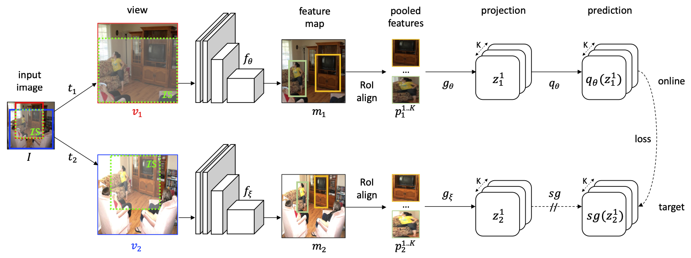

[](http://kakaobrain.com/)
[](https://pytorch.org/)
[](https://pytorch.org/)

# Spatially Consistent Representation Learning (CVPR'21)
* Official PyTorch implementation of [Spatially Consistent Representation Learning](https://arxiv.org/abs/2103.06122) (SCRL).

* This repository also includes implementation of [Bootstrap Your Own Latent](Bhttps://arxiv.org/abs/2006.07733YOL) (BYOL), one of our baselines.


## Abstract
SCRL is a self-supervised learning method that allows you to obtain a spatially consistent dense representation, especially useful for localization tasks such as object detection and segmentation. You might be able to improve your own localization task by simply initializing the backbone model with those parameters trained using our method. Please refer to the paper for more details.
<p align="center">

</p>

## Requirements
We have tested the code on the following environments: 
* Python 3.7.7 / Pytorch 1.6.0 / torchvision 0.7.0 / CUDA 10.1 / Ubuntu 18.04
* Python 3.8.3 / Pytorch 1.7.1 / torchvision 0.8.2 / CUDA 11.1 / Ubuntu 18.04

Run the following command to install dependencies:
```bash
pip install -r requirements.txt
```

## Configuration
The `config` directory contains predefined YAML configuration files for different learning methods and schedules.

There are two alternative ways to change training configuration:
* Change the value of the field of interest directly in `config/*.yaml` files.
* Pass the value as a command argument to `main.py` with the name that represents the field's hierarchy using the delimiter `/`.

Note that the values given by the command argument take precedence over the ones stored in the YAML file.

Refer to the **Dataset** subsection below for an example.

### Model
We officially support ResNet-50 and ResNet-101 backbones. Note that all the hyperparameters have been tuned based on ResNet-50.

### Dataset
Currently, only ImageNet dataset is supported. You *must* specify the dataset path in one of the following ways:
```yaml
# (option 1) set field `dataset.root` in the YAML configuration file.
data:
  root: your_own_path
  ...
```

```bash
# (option 2) pass `--dataset/root` as an argument of the shell command.
$ python main.py --data/root your_own_path ...
```

## How to Run

### Overview
The code consists of two main parts: self-supervised pre-training(upstream) and linear evaluation protocol(downstream). After the pre-training is done, the evaluation protocol is automatically run by the default configurations. Note that, for simplicity, this code does not hold out validation set from `train` set as in BYOL paper. Although this may not be a rigorous implementation, training the linear classifier itself is not in our main interest here and the protocol still does its job well enough as an evaluation metric. Also note that the protocol may not be exactly the same with the details in other literatures in terms of batch size and learning rate schedule.

### Resource & Batchsize
We recommend you run the code in a **multi-node environment** in order to reproduce the results reported in the paper. We used 4 V100 x 8 nodes = 32 GPUs for training. Under this circumstance, our upstream batch size is 8192 and downstream batch size is 4096. When the number of GPUs dwindled to half, we observed performance degradation. Although BYOL-like methods do not use negative examples in an explicit way, they can still suffer performance drops when their batch size is reduced, as illustrated in *Figure 3* in BYOL paper.


### Single-node Training
If your YAML configuration file is `./confing/scrl_200ep.yaml`, run the command as follows:
```bash
$ python main.py --config config/scrl_200_ep.yaml
```
### Multi-node Training
To train a single model with 2 nodes, for instance, run the commands below in sequence:
```bash
# on the machine #0
$ python main.py --config config/scrl_200_ep.yaml \
                 --dist_url tcp://{machine_0_ip}:{available_port} \
                 --num_machines 2 \
                 --machine_rank 0
```

```bash
# on the machine #1
$ python main.py --config config/scrl_200_ep.yaml \
                 --dist_url tcp://{machine_1_ip}:{available_port} \
                 --num_machines 2 \
                 --machine_rank 1
```
If IP address and port number are not known in advance, you can first run the command with `--dist_url=auto` in the master node. Then check the IP address and available port number that are printed on the command line, to which you should refer to launch the other nodes.

### Linear Evaluation Only


You can also run the protocol using any given checkpoint on a stand-alone basis. You can evaluate the latest checkpoint anytime after the very first checkpoint has been dumped. Refer to the following command:
```bash
$ python main.py --config config/scrl_200ep.yaml --train/enabled=False --load_dir ...
```

## Saving & Loading Checkpoints
### Saved Filenames
* `save_dir` will be automatically determined(with sequential number suffixes) unless otherwise designated.
* Model's checkpoints are saved in `./{save_dir}/checkpoint_{epoch}.pth`.
* Symlinks of the last checkpoints are saved in `./{save_dir}/checkpoint_last.pth`.
<!-- * The best checkpoints are be saved at `./{cfg.save_dir}/checkpoint_best.pth`. -->
### Automatic Loading
* `SCRLTraniner` will automatically load `checkpoint_last.pth` if it exists in `save_dir`. 
* By default, `save_dir` is identical to `load_dir`. However, you can also set `load_dir` seperately.


## Results

| Method   | Epoch   | Linear Eval (Acc.)        | COCO BBox (AP) | COCO Segm (AP)   | Checkpoint    |
|---------:|--------:|--------------------------:|---------------:|-----------------:|--------------:|
| Random   | --      |--&ensp; / &ensp; -- &ensp;| 29.77 / 30.95  | 28.70            | --            |
| IN-sup.  | 90      |--&ensp; / &ensp;74.3      | 38.52 / 39.00  | 35.44            | --            |
| BYOL     | 200     | 72.90 / 73.14             | 38.35 / 38.86  | 35.96            | [download](http://arena.kakaocdn.net/brainrepo/scrl/byol_200ep.pth) |
| BYOL     | 1000    | 74.47 / 74.51             | 40.10 / 40.19  | 37.16            | [download](http://arena.kakaocdn.net/brainrepo/scrl/byol_1000ep.pth)|
| **SCRL** | 200     | 66.78 / 68.27             | 40.49 / 41.02  | 37.50            | [download](http://arena.kakaocdn.net/brainrepo/scrl/scrl_200ep.pth) |
| **SCRL** | 1000    | 70.67 / 70.66             | 40.92 / 41.40  | 37.92            | [download](http://arena.kakaocdn.net/brainrepo/scrl/scrl_1000ep.pth)|

* **Epoch**: self-supervised pre-training epochs
* **Linear Eval**(linear evaluation): `online` **/** `offline`
* **COCO Bbox**(Object Detection): `Faster R-CNN w.FPN` **/**  `Mask R-CNN w.FPN` 
* **COCO Segm**(Instance Segmentation): `Mask R-CNN w.FPN` 

### On/offline Linear Evaluation
The **online** evaluation is done with a linear classifier attached to the top of the backbone, which is trained simultaneously during pre-training under its own objective but does NOT backpropagate the gradients to the main model. This facilitates monitoring of the learning progress while there is no target performance measure for self-supervised learning. The **offline** evaluation refers to the commonly known standard protocol.

### COCO Localization Tasks

As you can see in the table, our method significantly boosts the performance of the localization downstream tasks. Note that the values in the table can be slightly different from the paper because of different random seeds. For the COCO localization tasks, we used [Detectron2](https://github.com/facebookresearch/detectron2) repository publicly available, which is not included in this code. We simply initialized the ResNet-50 backbone with pre-trained parameters by our method and finetuned it under the downstream objective. Note that we used synchronized BN for all the configurable layers and retained the default hyperparameters for everything else including the training schedule(x1).

### Downloading Pretrained Checkpoints
You can download the backbone checkpoints via those links in the table. To load them in our code and run the linear evaluation, change the filename to `checkpoint_last.pth` (or make symlink) and pass the parent directory path to either `save_dir` or `load_dir`.

### Hyperparameters
For the 1000 epoch checkpoint of SCRL, we simply used the hyperparameters adopted in the official BYOL implementation, which is different from the description in the paper, but still matches the reported performance. As described in the Appendix in the paper, there could be potential room for improvement by extensive hyperparameter search.

## Citation
If you use this code for your research, please cite our paper.
```
@inproceedings{roh2021scrl,
  title={Spatilly Consistent Representation Learning},
  author    = {Byungseok Roh and
               Wuhyun Shin and
               Ildoo Kim and
               Sungwoong Kim},
  booktitle = {CVPR},
  publisher = {IEEE},
  year      = {2021}
}
```

## Contact for Issues
* Wuhyun Shin, aiden.hsin@kakaobrain.com
* Byungseok Roh, peter.roh@kakaobrain.com

## License

This project is licensed under the terms of **the Apache License 2.0**.

Copyright 2021 Kakao Brain Corp. <https://www.kakaobrain.com> All Rights Reserved.